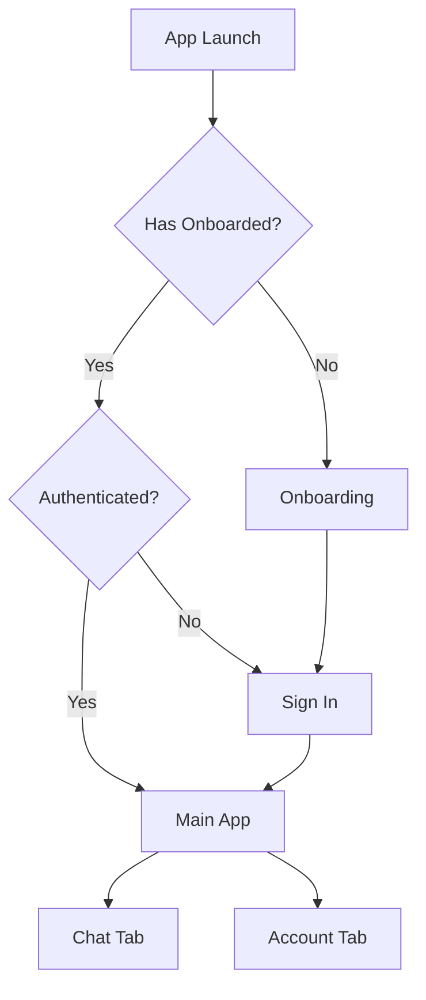

## Overview

Synto Mobile is built with **Expo** and **React Native**, using file-based routing powered by **Expo Router**. The app integrates Solana blockchain functionality through the Mobile Wallet Adapter protocol, enabling seamless wallet connections and transaction signing.

## Technology stack

The app is built on modern React Native technologies:

<CardGroup cols={2}>
  <Card title="Expo SDK 53" icon="circle-nodes">
    Using the new architecture with React Native 0.79.5
  </Card>
  <Card title="Expo Router 5" icon="route">
    File-based routing with typed routes and navigation guards
  </Card>
  <Card title="React 19" icon="react">
    Latest React with concurrent features
  </Card>
  <Card title="TypeScript 5.8" icon="code">
    Strict type checking throughout the codebase
  </Card>
</CardGroup>

### Key dependencies

```json package.json
{
  "@solana-mobile/mobile-wallet-adapter-protocol-web3js": "^2.2.2",
  "@solana/web3.js": "^1.98.2",
  "@tanstack/react-query": "^5.80.6",
  "@ai-sdk/openai": "^1.3.23",
  "expo-router": "~5.1.0"
}
```

## Project structure

The codebase follows a feature-based organization:

<CodeGroup>
```bash Directory structure
synto-mobile/
├── app/                    # File-based routing
│   ├── _layout.tsx        # Root layout with providers
│   ├── (tabs)/            # Tab navigation group
│   │   ├── index.tsx      # Redirects to chat
│   │   └── chat/          # Chat screens
│   ├── sign-in.tsx        # Authentication screen
│   ├── onboarding.tsx     # First-time user flow
│   └── api/               # API routes
├── components/            # Organized by feature
│   ├── account/           # Wallet & balance components
│   ├── auth/              # Authentication provider
│   ├── chat/              # Chat interface components
│   ├── cluster/           # Solana network management
│   ├── solana/            # Wallet adapter integration
│   ├── settings/          # App settings
│   └── ui/                # Reusable UI components
├── hooks/                 # Custom React hooks
├── utils/                 # Utility functions
│   └── syntoUtils/        # Solana agent integration
├── constants/             # App configuration
└── lib/                   # Services & utilities
```

```typescript Path aliases (tsconfig.json)
{
  "compilerOptions": {
    "paths": {
      "@/*": ["./*"]
    }
  }
}
```
</CodeGroup>

## Provider hierarchy

The app uses a layered provider architecture to manage global state and configuration:

```tsx app/_layout.tsx
import { AppProviders } from "@/components/app-providers";

export default function RootLayout() {
  return (
    <View style={{ flex: 1 }}>
      <AppProviders>
        <AppSplashController />
        <RootNavigator />
        <StatusBar style="auto" />
      </AppProviders>
      <PortalHost />
    </View>
  );
}
```

### Provider stack

Providers are nested in this specific order:

<Steps>
  <Step title="AppTheme">
    Provides theme context (light/dark mode) using React Navigation's theme system
  </Step>
  
  <Step title="QueryClientProvider">
    TanStack Query for server state management and caching
  </Step>
  
  <Step title="ClusterProvider">
    Manages Solana network selection (Devnet, Testnet, Mainnet)
  </Step>
  
  <Step title="SolanaProvider">
    Creates and manages Solana RPC connection based on selected cluster
  </Step>
  
  <Step title="AuthProvider">
    Handles wallet authentication and onboarding state
  </Step>
</Steps>

<CodeGroup>
```tsx components/app-providers.tsx
import { QueryClient, QueryClientProvider } from "@tanstack/react-query";
import { ClusterProvider } from "./cluster/cluster-provider";
import { SolanaProvider } from "@/components/solana/solana-provider";
import { AppTheme } from "@/components/app-theme";
import { AuthProvider } from "@/components/auth/auth-provider";

const queryClient = new QueryClient();

export function AppProviders({ children }: PropsWithChildren) {
  return (
    <AppTheme>
      <QueryClientProvider client={queryClient}>
        <ClusterProvider>
          <SolanaProvider>
            <AuthProvider>{children}</AuthProvider>
          </SolanaProvider>
        </ClusterProvider>
      </QueryClientProvider>
    </AppTheme>
  );
}
```

```tsx Cluster provider example
export function ClusterProvider({ children }: { children: ReactNode }) {
  const [selectedCluster, setSelectedCluster] = useState<Cluster>(
    AppConfig.clusters[0]
  );
  
  const value = useMemo(
    () => ({
      selectedCluster,
      clusters: [...AppConfig.clusters].sort((a, b) => 
        a.name > b.name ? 1 : -1
      ),
      setSelectedCluster,
      getExplorerUrl: (path: string) =>
        `https://explorer.solana.com/${path}${getClusterUrlParam(selectedCluster)}`,
    }),
    [selectedCluster]
  );
  
  return <Context.Provider value={value}>{children}</Context.Provider>;
}
```
</CodeGroup>

## Navigation architecture

Synto Mobile uses **Expo Router** with file-based routing and navigation guards for authentication.

### Route protection

The app implements a three-tier navigation guard system:

```tsx app/_layout.tsx
function RootNavigator() {
  const { isAuthenticated, hasCompletedOnboarding } = useAuth();
  
  return (
    <Stack screenOptions={{ headerShown: false }}>
      <Stack.Protected guard={isAuthenticated}>
        <Stack.Screen name="(tabs)" />
        <Stack.Screen name="+not-found" />
      </Stack.Protected>
      
      <Stack.Protected guard={!isAuthenticated && hasCompletedOnboarding}>
        <Stack.Screen name="sign-in" />
      </Stack.Protected>
      
      <Stack.Protected guard={!isAuthenticated && !hasCompletedOnboarding}>
        <Stack.Screen name="onboarding" />
      </Stack.Protected>
    </Stack>
  );
}
```

<Note>
The guard system automatically redirects users based on their authentication and onboarding status:
- New users → Onboarding screen
- Returning users (not authenticated) → Sign in screen
- Authenticated users → Main app (tabs)
</Note>

### Navigation flow



## State management patterns

The app uses multiple state management approaches:

<Tabs>
  <Tab title="Server State">
    **TanStack Query** for blockchain data:
    
    ```tsx components/account/use-get-balance.tsx
    export function useGetBalance({ address }: { address: PublicKey }) {
      const connection = useConnection();
      const queryKey = useGetBalanceQueryKey({ 
        address, 
        endpoint: connection.rpcEndpoint 
      });
      
      return useQuery({
        queryKey,
        queryFn: () => connection.getBalance(address),
      });
    }
    ```
    
    Features automatic caching, refetching, and invalidation.
  </Tab>
  
  <Tab title="Global State">
    **React Context** for app-wide state:
    
    - Authentication state (AuthProvider)
    - Network selection (ClusterProvider)
    - Solana connection (SolanaProvider)
    - Theme preferences (AppTheme)
  </Tab>
  
  <Tab title="Local State">
    **useState/useReducer** for component-specific state:
    
    ```tsx
    const [showHistory, setShowHistory] = useState(false);
    const [currentChat, setCurrentChat] = useState<Chat | null>(null);
    ```
  </Tab>
  
  <Tab title="Persistent State">
    **AsyncStorage** for data persistence:
    
    ```tsx components/auth/auth-provider.tsx
    const loadOnboardingStatus = async () => {
      const completed = await AsyncStorage.getItem(ONBOARDING_COMPLETE_KEY);
      setHasCompletedOnboarding(completed === "true");
    };
    ```
  </Tab>
</Tabs>

## Solana integration

The app integrates with Solana through multiple layers:

### Mobile Wallet Adapter

Core wallet functionality using the `transact` pattern:

```tsx components/solana/use-mobile-wallet.tsx
export function useMobileWallet() {
  const { authorizeSession, deauthorizeSessions } = useAuthorization();
  
  const signAndSendTransaction = useCallback(
    async (transaction: Transaction | VersionedTransaction) => {
      return await transact(async (wallet) => {
        await authorizeSession(wallet);
        const signatures = await wallet.signAndSendTransactions({
          transactions: [transaction],
        });
        return signatures[0];
      });
    },
    [authorizeSession]
  );
  
  return { signAndSendTransaction, /* ... */ };
}
```

### Agent-based actions

The app uses a Solana Agent Kit for AI-powered blockchain interactions:

```tsx hooks/use-agent.tsx
export function useSolanaAgent() {
  const { signAndSendTransaction, signTransactions, signMessage } = useMobileWallet();
  const { account } = useWalletUi();
  
  const agent = useMemo(() => {
    if (!account?.publicKey) return null;
    
    const fns = {
      signTransaction: async (tx) => { /* ... */ },
      signMessage: async (msg) => { /* ... */ },
      sendTransaction: async (tx) => { /* ... */ },
      publicKey: account.publicKey,
    };
    
    return agentBuilder(fns, { signOnly: false });
  }, [account, signAndSendTransaction, signTransactions, signMessage]);
  
  const tools = useMemo(() => {
    if (agent) {
      return createVercelAITools(agent, agent.actions);
    }
    return null;
  }, [agent]);
  
  return { agent, tools, isReady: !!agent };
}
```

<Warning>
The agent is only created when a wallet is connected (`account.publicKey` exists). Always check `isReady` before using agent tools.
</Warning>

### Available plugins

The agent system supports modular plugins:

<CardGroup cols={2}>
  <Card title="Token Plugin" icon="coins">
    Transfer, balance checks, token accounts, faucet requests
  </Card>
  <Card title="Jupiter Plugin" icon="arrow-right-arrow-left">
    Token swaps, price fetching, staking
  </Card>
  <Card title="DexScreener Plugin" icon="chart-line">
    Token data and market information
  </Card>
  <Card title="DeFi Plugin" icon="building-columns">
    Lending protocols (RainFi integration)
  </Card>
</CardGroup>

## Chat architecture

The chat system integrates AI capabilities with blockchain actions:

### Multi-chat management

```tsx hooks/use-multi-chat.tsx
export function useMultiChat() {
  const [currentChat, setCurrentChat] = useState<Chat | null>(null);
  const [chatList, setChatList] = useState<ChatMetadata[]>([]);
  
  const syncMessages = useCallback(
    async (messages: Message[]) => {
      const chatMessages = messages.map((msg) => ({
        id: msg.id,
        role: msg.role,
        content: msg.content,
        timestamp: msg.createdAt?.getTime() || Date.now(),
        toolInvocations: msg.toolInvocations,
      }));
      
      await ChatStorageService.saveChat({
        ...currentChat,
        messages: chatMessages,
        updatedAt: Date.now(),
      });
    },
    [currentChat]
  );
  
  return {
    currentChat,
    chatList,
    createNewChat,
    loadChat,
    deleteChat,
    syncMessages,
  };
}
```

### AI SDK integration

Chat uses Vercel AI SDK with tool support:

```tsx app/(tabs)/chat/index.tsx
const { messages, handleSubmit, isLoading } = useChat({
  headers: {
    Authorization: process.env.EXPO_PUBLIC_BACKEND_KEY || "",
  },
  body: {
    userAddress: account?.publicKey?.toString() || "",
  },
  api: `${process.env.EXPO_PUBLIC_BACKEND_URL}/api/chat`,
  onError: (error) => console.error(error),
});
```

## Build configuration

The app uses Expo Application Services (EAS) for builds:

```json eas.json
{
  "build": {
    "development": {
      "developmentClient": true,
      "distribution": "internal"
    },
    "preview": {
      "distribution": "internal"
    },
    "production": {
      "autoIncrement": true
    }
  }
}
```

<Note>
The app has `newArchEnabled: true` in `app.json`, enabling React Native's new architecture with Fabric renderer and TurboModules.
</Note>

## Performance considerations

<AccordionGroup>
  <Accordion title="Query caching strategy">
    Balance and token account queries are cached with automatic invalidation:
    
    ```tsx
    const invalidateBalance = useGetBalanceInvalidate({ address });
    const invalidateTokenAccounts = useGetTokenAccountsInvalidate({ address });
    
    const onRefresh = useCallback(async () => {
      await Promise.all([invalidateBalance(), invalidateTokenAccounts()]);
    }, [invalidateBalance, invalidateTokenAccounts]);
    ```
  </Accordion>
  
  <Accordion title="Memoization patterns">
    Heavy computations are memoized:
    
    ```tsx
    const agent = useMemo(() => {
      if (!account?.publicKey) return null;
      return agentBuilder(fns, { signOnly: false });
    }, [account, signAndSendTransaction, signTransactions]);
    ```
  </Accordion>
  
  <Accordion title="Connection management">
    Solana connection is recreated only when cluster changes:
    
    ```tsx
    const connection = useMemo(
      () => new Connection(selectedCluster.endpoint, config),
      [selectedCluster, config]
    );
    ```
  </Accordion>
</AccordionGroup>

## Error handling

The app implements automatic error recovery for wallet disconnections:

```tsx components/solana/use-mobile-wallet.tsx
const handleWalletError = useCallback(
  async (error: any) => {
    console.error("Wallet error:", error);
    
    const isAuthError =
      error?.message?.includes("authorization") ||
      error?.message?.includes("not authorized") ||
      error?.code === "UNAUTHORIZED";
    
    if (isAuthError) {
      await deauthorizeSessions();
    }
    
    throw error;
  },
  [deauthorizeSessions]
);
```

## Next steps

<CardGroup cols={2}>
  <Card title="Component structure" icon="cubes" href="/development/components">
    Learn about the component organization
  </Card>
  <Card title="Custom hooks" icon="hook" href="/development/hooks">
    Explore reusable React hooks
  </Card>
  <Card title="Building the app" icon="hammer" href="/development/building">
    Build and deploy instructions
  </Card>
</CardGroup>